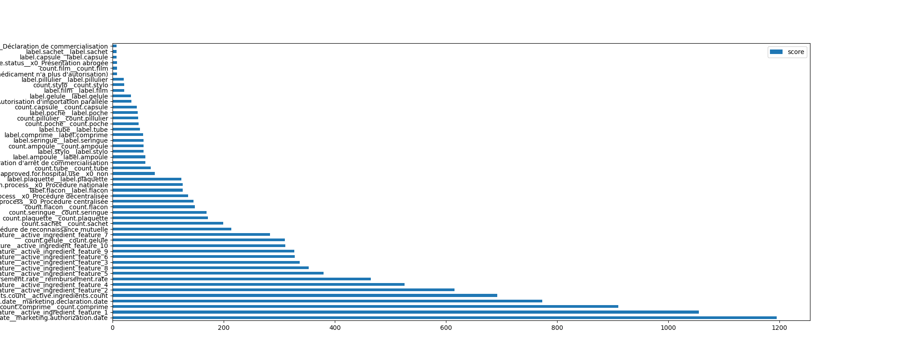
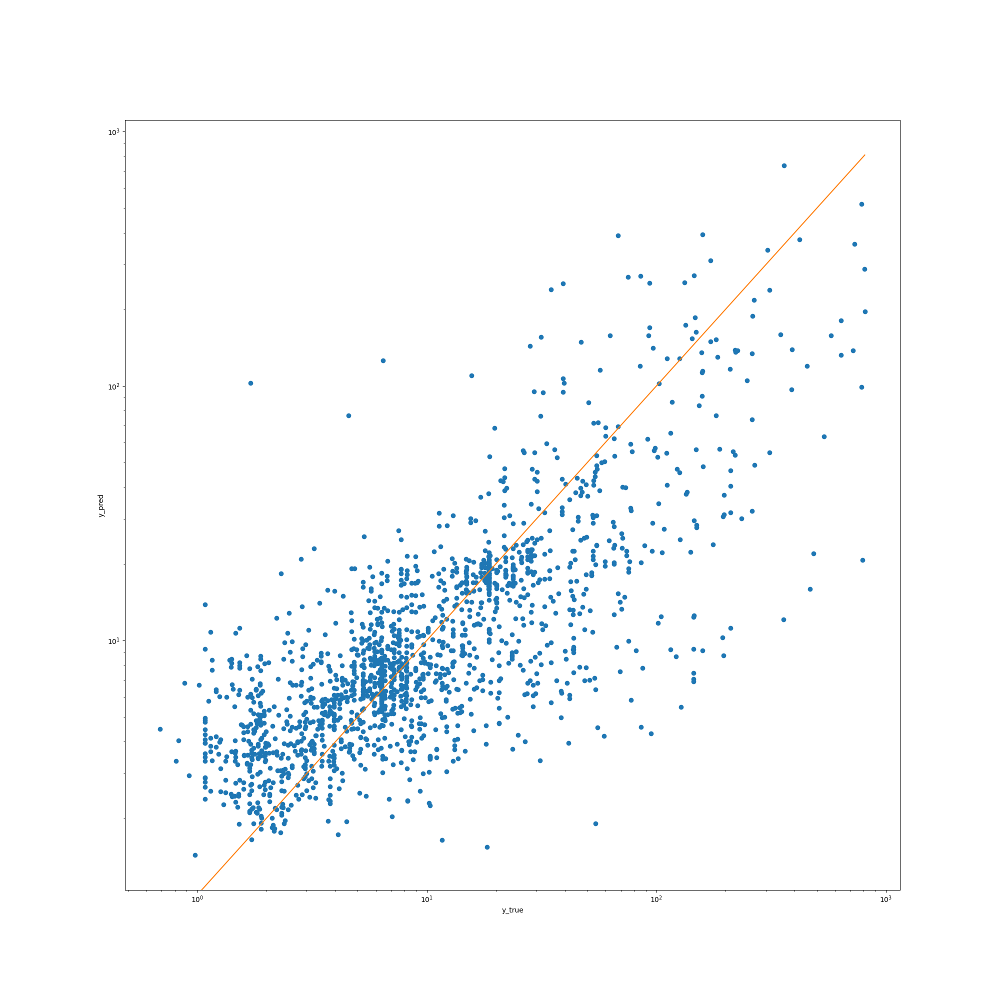

# Drug Price Prediction

## Project Description

The objective is to predict the price for each drug in the test data set (`drugs_test.csv`). Please refer to the `sample_submission.csv` file for the correct format for submissions.


## Installation

The project was developed with `Python 3.9.5`, but should be compatible with older version of Python 3 
(although this wasn't tested)

1. Create a virtual environment with `venv` (or any method of your choice) and activate it:
```shell
python3 -m venv venv
source venv/bin/activate
```

2. Install requirements:
```shell
pip install -r requirements.txt
```

3. Unzip the data in data.zip and put all `.csv` files under the `data` folder. You can run the following shell script
```
. data/unzip_data.sh
```

## Run the code

The package can be called via CLI - 2 pipelines (`train` and `predict`) are implemented

* Train pipeline
```shell
python -m src --do-train
```

* Predict pipeline
```shell
python -m src --do-predict
```

Advanced parametrization of the train pipeline can be done via `src/config.py`, where you can:
1. Update the hyperparameters of the `Regressor` model
2. Precise if you want to:

```python
use_grid_search: bool = False # <-- Set to True if you want to tune the hyperparameters of the model
use_cross_validation: bool = True # <-- Set to True if you want to compute the performance of the model using cross-validation
visualize_results: bool = True # <-- Set to True to get some plots to visualize the output of the model
save_model: bool = True # <-- Set to True to save the model in a pickle file
```

## Modeling aspects & discussion

### Evaluation metric
The `price` variable I are modelling has a pretty wide distribution
```
- min: 0.6
- max: 990.4
- mean: 28.5
- std: 81.4
```

Depending on the business question we want to solve, we might prefer
- to be more accurate on higher-priced products
- to predict a price range for products (e.g. [0-1], [1-5], ... [100-500], [500+]) 
- etc.

This utimately changes the evaluation metric we optimize and the way we model price. 

Missing a bit of business contest I chose to optimize for the mean squared error of the log-price, such that a 50% error
on a cheap drug has the same "weight" as a 50% error on an expensive drug.

### Feature engineering
The feature engineering code is available at `/Users/izadisacha/Documents/MM_case/src/feature_engineering`.
Most features provided were plugged as is into the model, except for :
- categorical variables, that were one-hot encoded
- active ingredients, where we added a "number of active ingredients per drug" feature, as well as dimensionality
  reduction because the number of active ingredients was pretty high and plugging them directly would have been prone to
  overfitting.
  
Next steps:
- I did not use the pharmaceutical manufacturer information. I expect it to have quite some impact by integrating a 
  notion of generic drugs vs. branded-drugs (which are usually 1.x to 2 times more expensive).
    
### Model choice
I chose to go for a XGBoost regressor as core model, that aims at predicting `log(price)` to be aligned with the final
metric we optimize for. I also added a grid search method for fine-tuning the hyperparameters.

## Overall performance of the algorithm
The model performs significantly better than a "baseline" model (that simply predicts the mean):
```
- Baseline 'dummy' model `mean_squared_log_error`: 2.2
- Model ‘mean_squared_log_error’ on TEST set: 0.50
```

The performance should still be improved as the model 
- still has a high loss *(the model has the capacity to overfit the dataset - in some experiments I reduced the error 
  to ~0 on the training set with high `tree_depth`)*
- is overfitting the training set by a non-negligible rate: 
```
- Mean of ‘neg_mean_squared_log_error’ on TRAIN set: -0.27
 Mean of ‘neg_mean_squared_log_error’ on TEST set: -0.50
```

### Feature importance:
We see that active ingredients and count of gellules/plaquettes/etc. have the highest feature importance.
This makes sense since 
- molecules can have very different production & R&D costs, yielding to very different price of the final drug
- a pack of 20 tabs is likely to be x2 the price of a pack of 10 tabs




### Distribution of the errors/predictions:
We see that the model tends to over-predict on low prices, and under-predict on high prices. This should be
investigated in a second iteration.




## Personal comment
This was a fun and interesting project. I'm particularly happy & proud to have had the chance to hack around with the 
sklearn library :
- designing an end-to-end `sklearn` pipeline
- adding a `TransformedTargetRegressor` layer on top of the XGBoost
- play with the feature importance API of XGBoost.


## Files & Field Descriptions

You'll find five CSV files:
- `drugs_train.csv`: training data set,
- `drugs_test.csv`: test data set,
- `active_ingredients.csv`: active ingredients in the drugs.
- `drug_label_feature_eng.csv`: feature engineering on the text description,
- `sample_submission.csv`: the expected output for the predictions.

### Drugs

Filenames: `drugs_train.csv` and `drugs_test.csv`

| Field | Description |
| --- | --- |
| `drug_id` | Unique identifier for the drug. |
| `description` | Drug label. |
| `administrative_status` | Administrative status of the drug. |
| `marketing_status` | Marketing status of the drug. |
| `approved_for_hospital_use` | Whether the drug is approved for hospital use (`oui`, `non` or `inconnu`). |
| `reimbursement_rate` | Reimbursement rate of the drug. |
| `dosage_form` | See [dosage form](https://en.wikipedia.org/wiki/Dosage_form).|
| `route_of_administration` | Path by which the drug is taken into the body. Comma-separated when a drug has several routes of administration. See [route of administration](https://en.wikipedia.org/wiki/Route_of_administration). |
| `marketing_authorization_status` | Marketing authorization status. |
| `marketing_declaration_date` | Marketing declaration date. |
| `marketing_authorization_date` | Marketing authorization date. |
| `marketing_authorization_process` | Marketing authorization process. |
| `pharmaceutical_companies` | Companies owning a license to sell the drug. Comma-separated when several companies sell the same drug. |
| `price` | Price of the drug (i.e. the output variable to predict). |

**Note:** the `price` column only exists for the train data set.

### Active Ingredients

Filename: `active_ingredients.csv`

| Field | Description |
| --- | --- |
| `drug_id` | Unique identifier for the drug. |
| `active_ingredient` | [Active ingredient](https://en.wikipedia.org/wiki/Active_ingredient) in the drug. |

**Note:** some drugs are composed of several active ingredients.

### Text Description Feature Engineering

Filename: `drug_label_feature_eng.csv`

This file is here to help you and provide some feature engineering on the drug labels.

| Field | Description |
| --- | --- |
| `description` | Drug label. |
| `label_XXXX` | Dummy coding using the words in the drug label (e.g. `label_ampoule` = `1` if the drug label contains the word `ampoule` - vial in French). |
| `count_XXXX` | Extract the quantity from the description (e.g. `count_ampoule` = `32` if the drug label  the sequence `32 ampoules`). |

**Note:** This data has duplicate records and some descriptions in `drugs_train.csv` or `drugs_test.csv` might not be present in this file.
